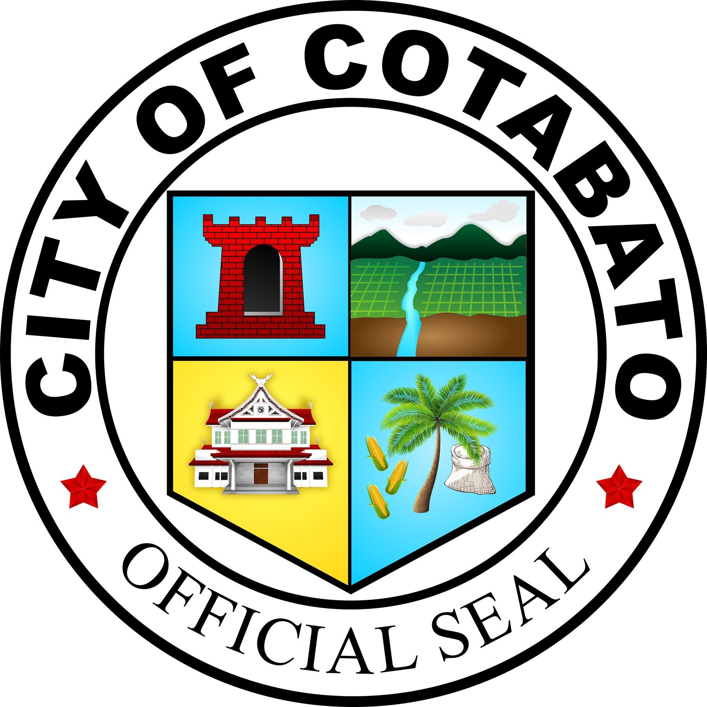
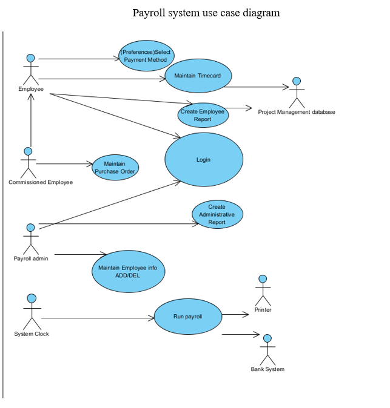

# Local Government of Cotabato
#

### Frameworks
Frameworks used
*  - [Laravel + Breeze](https://github.com/laravel/breeze)
*  - [React](https://reactjs.org/)
*  - [MySQL](https://www.mysql.com/)

### Payroll Management System
* Payroll management system is the process by which employers pay wages to their employees. It's also how they demonstrate their commitment to their workers, fulfill their obligations to government agencies and keep financial records in order.

### Sub System
* Project Management database

* Printer

* Bank System

